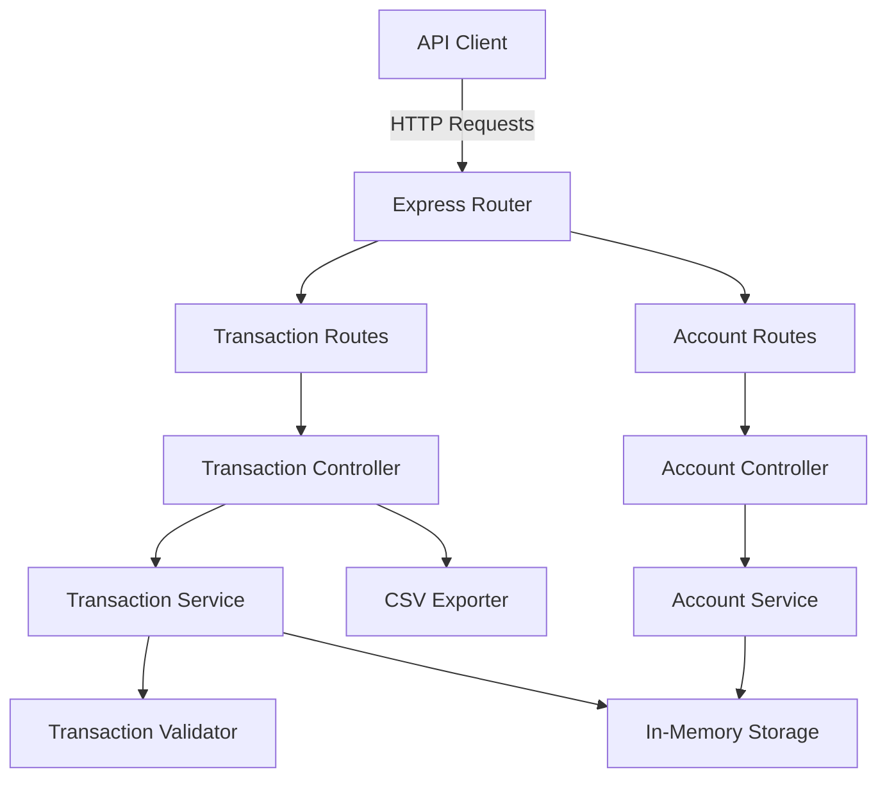

# Banking Transactions API Implementation Plan

## Technology Stack

- **Runtime**: Node.js with TypeScript
- **Framework**: Express.js
- **Storage**: In-memory (arrays/objects)
- **Additional Feature**: Transaction Export (CSV)

## Project Architecture

## Implementation Steps

### 1. Project Setup and Configuration

**Files to create:**

- [`homework-1/package.json`](../package.json) - Dependencies and scripts
- [`homework-1/tsconfig.json`](../tsconfig.json) - TypeScript configuration
- [`homework-1/.gitignore`](../.gitignore) - Exclude node_modules, dist, .env
- [`homework-1/.env.example`](homework-1/.env.example) - Environment variables template

**Dependencies:**

- express, typescript, ts-node, @types/node, @types/express
- nodemon for development
- Optional: dotenv for environment variables

### 2. Core Data Models and Types

**File:** [`homework-1/src/models/transaction.ts`](../src/models/transaction.ts)

Define TypeScript interfaces:

- `Transaction` interface matching the specification
- `TransactionType` enum (deposit, withdrawal, transfer)
- `TransactionStatus` enum (pending, completed, failed)
- `Account` interface for account balance tracking

### 3. Validation Layer (Task 2)

**File:** [`homework-1/src/validators/transactionValidator.ts`](../src/validators/transactionValidator.ts)

Implement validation functions:

- Amount validation (positive, max 2 decimals)
- Account format validation (ACC-XXXXX pattern)
- Currency validation (ISO 4217 codes: USD, EUR, GBP, JPY, etc.)
- Return structured error responses with field-specific messages

### 4. Storage Service

**File:** [`homework-1/src/services/storageService.ts`](../src/services/storageService.ts)

In-memory storage implementation:

- Transactions array
- Accounts map for balance tracking
- Helper methods for CRUD operations
- Auto-generate transaction IDs (UUID or sequential)

### 5. Transaction Service (Business Logic)

**File:** [`homework-1/src/services/transactionService.ts`](../src/services/transactionService.ts)

Core business logic:

- Create transaction with validation
- Retrieve all transactions with filtering (Task 3)
- Retrieve transaction by ID
- Filter by accountId, type, date range
- Update account balances based on transaction type

### 6. Account Service

**File:** [`homework-1/src/services/accountService.ts`](../src/services/accountService.ts)

Account-related operations:

- Calculate account balance
- Track deposits and withdrawals
- Initialize accounts as needed

### 7. CSV Export Utility (Task 4 - Option C)

**File:** [`homework-1/src/utils/csvExporter.ts`](../src/utils/csvExporter.ts)

CSV export functionality:

- Convert transactions array to CSV format
- Include headers: id, fromAccount, toAccount, amount, currency, type, timestamp, status
- Handle special characters and escaping
- Return as downloadable file

### 8. API Routes and Controllers

**Files:**

- [`homework-1/src/routes/transactionRoutes.ts`](../src/routes/transactionRoutes.ts)
- [`homework-1/src/routes/accountRoutes.ts`](../src/routes/accountRoutes.ts)
- [`homework-1/src/controllers/transactionController.ts`](../src/controllers/transactionController.ts)
- [`homework-1/src/controllers/accountController.ts`](../src/controllers/accountController.ts)

**Endpoints to implement:**

| Method | Endpoint | Controller Method |

|--------|----------|------------------|

| POST | /transactions | createTransaction |

| GET | /transactions | getAllTransactions |

| GET | /transactions/:id | getTransactionById |

| GET | /accounts/:accountId/balance | getAccountBalance |

| GET | /transactions/export | exportTransactions |

### 9. Main Application Entry Point

**File:** [`homework-1/src/index.ts`](../src/index.ts)

Express app setup:

- Middleware configuration (JSON parsing, CORS if needed)
- Route registration
- Error handling middleware
- Server startup on port 3000

### 10. Demo and Testing Files

**Files to create:**

- [`homework-1/demo/run.sh`](run.sh) - Start script
- [`homework-1/demo/sample-requests.http`](sample-requests.http) - REST Client requests
- [`homework-1/demo/sample-data.json`](sample-data.json) - Sample transactions

### 11. Documentation

**Files to update:**

- [`homework-1/README.md`](../README.md) - Project overview, architecture, AI tools used
- [`homework-1/HOWTORUN.md`](../HOWTORUN.md) - Installation and run instructions

## Key Features Summary

**Task 1 - Core API**: All 4 required endpoints with proper HTTP status codes (200, 201, 400, 404)

**Task 2 - Validation**: Comprehensive validation with structured error responses

**Task 3 - Filtering**: Query parameters for accountId, type, and date range (from/to)

**Task 4 - CSV Export**: GET /transactions/export?format=csv endpoint

## Error Handling Strategy

- 400 Bad Request: Validation errors
- 404 Not Found: Transaction/account not found
- 500 Internal Server Error: Unexpected errors
- Consistent error response format with error and details fields

## Testing Approach

Manual testing using:

- curl commands
- VS Code REST Client (.http files)
- Postman (optional)

Test all endpoints with valid and invalid data to verify validation and error handling.