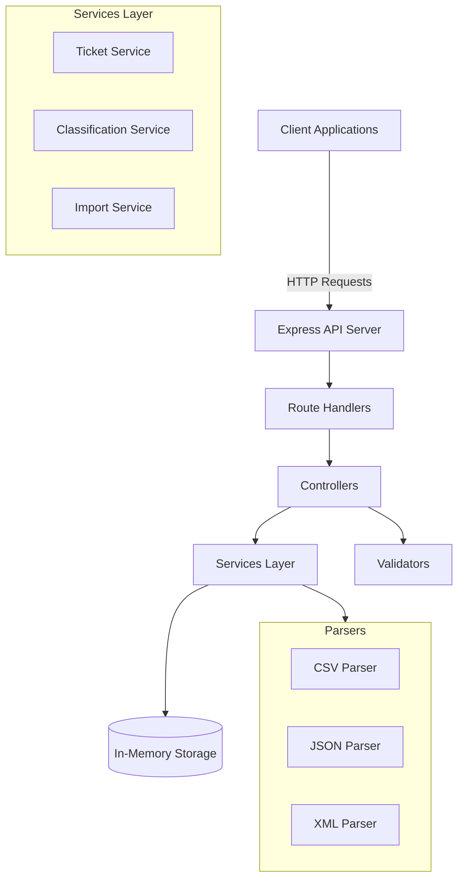

# Customer Support System API

An intelligent customer support ticket management system with multi-format import capabilities and automatic ticket classification.

## Features

- **Multi-Format Import**: Import tickets from CSV, JSON, and XML files
- **Auto-Classification**: Automatically categorize tickets and assign priorities based on keywords
- **RESTful API**: Complete CRUD operations for ticket management
- **Filtering**: Advanced filtering by category, priority, status, and more
- **High Test Coverage**: >85% code coverage with comprehensive test suite
- **TypeScript**: Fully typed for better development experience

## Architecture



## Project Structure

```
homework-2/
├── src/
│   ├── index.ts                      # Server entry point
│   ├── app.ts                        # Express app configuration
│   ├── models/
│   │   └── ticket.ts                 # TypeScript interfaces and types
│   ├── validators/
│   │   └── ticketValidator.ts        # Zod validation schemas
│   ├── services/
│   │   ├── ticketService.ts          # Ticket CRUD operations
│   │   ├── classificationService.ts  # Auto-classification logic
│   │   └── importService.ts          # File import orchestration
│   ├── parsers/
│   │   ├── csvParser.ts              # CSV file parser
│   │   ├── jsonParser.ts             # JSON file parser
│   │   └── xmlParser.ts              # XML file parser
│   ├── controllers/
│   │   └── ticketController.ts       # Request handlers
│   ├── routes/
│   │   └── ticketRoutes.ts           # Route definitions
│   └── utils/
│       └── logger.ts                 # Classification logging
├── tests/
│   ├── test_ticket_api.test.ts       # API endpoint tests
│   ├── test_ticket_model.test.ts     # Validation tests
│   ├── test_import_csv.test.ts       # CSV parser tests
│   ├── test_import_json.test.ts      # JSON parser tests
│   ├── test_import_xml.test.ts       # XML parser tests
│   ├── test_categorization.test.ts   # Classification tests
│   ├── test_integration.test.ts      # End-to-end tests
│   ├── test_performance.test.ts      # Performance benchmarks
│   ├── test_logger.test.ts           # Logger utility tests
│   ├── test_import_service.test.ts   # Import service tests
│   └── fixtures/                     # Test data files
├── demo/
    └── sample-data/
│       ├── sample_tickets.csv            # Sample CSV data (50 tickets)
│       ├── sample_tickets.json           # Sample JSON data (20 tickets)
│       └── sample_tickets.xml            # Sample XML data (30 tickets)
└── docs/
    ├── screenshots/                  # Documentation screenshots
    ├── API_REFERENCE.md              # Detailed API documentation
    ├── ARCHITECTURE.md               # Architecture documentation
    └── TESTING_GUIDE.md              # Testing guidelines

```

## AI Tools Used

This project was developed with assistance from AI coding tools:

- **Cursor**: Used for code generation, refactoring, and test creation
- **GitHub Copilot**: Assisted with boilerplate code and documentation
- **AI-assisted debugging**: Helped identify and fix edge cases in parsers


## Additional Documentation

- [HOWTORUN.md](HOWTORUN.md) - Step-by-step guide to run the application
- [API_REFERENCE.md](docs/API_REFERENCE.md) - Detailed API documentation
- [ARCHITECTURE.md](docs/ARCHITECTURE.md) - Architecture documentation
- [TESTING_GUIDE.md](docs/TESTING_GUIDE.md) - Testing guidelines
