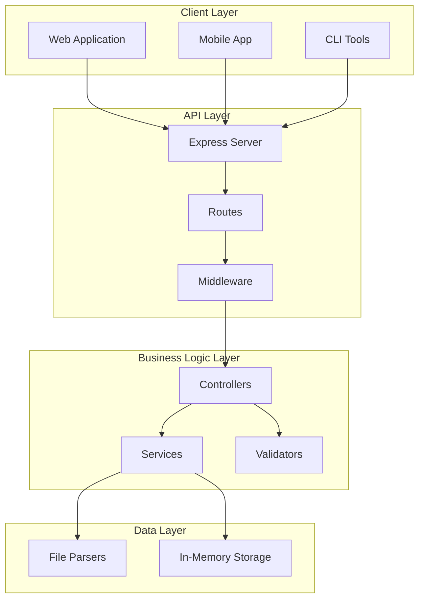
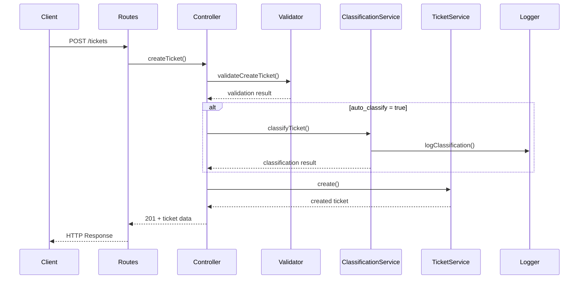
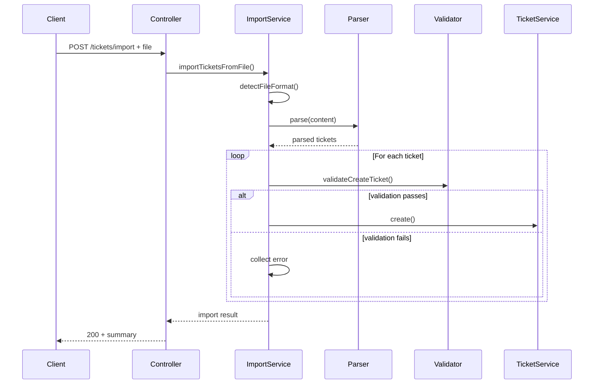
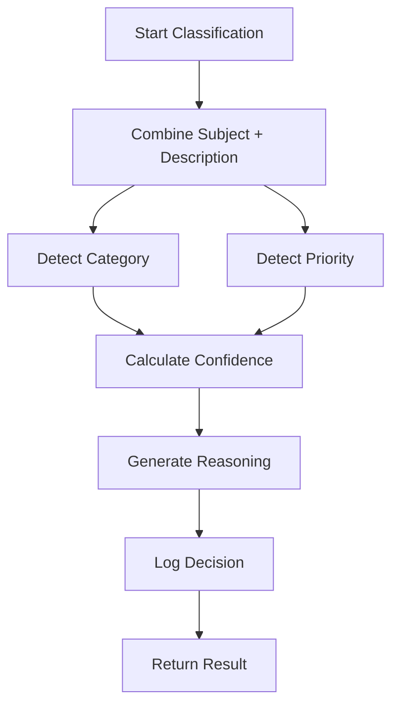

# Architecture Documentation

## High-Level Architecture

The Customer Support System follows a layered architecture pattern with clear separation of concerns.



## Component Descriptions

### API Layer

#### Express Server (`src/app.ts`, `src/index.ts`)
- Configures Express application with middleware
- Sets up routes and error handling
- Exports app for testing purposes
- Entry point starts the server on configured port

#### Routes (`src/routes/ticketRoutes.ts`)
- Defines all HTTP endpoints
- Maps URLs to controller functions
- Configures multer for file uploads
- Handles route-level middleware

### Business Logic Layer

#### Controllers (`src/controllers/ticketController.ts`)
- Handle HTTP requests and responses
- Validate request data using Zod schemas
- Coordinate between services
- Format responses with appropriate status codes
- Handle errors gracefully

#### Services

**Ticket Service** (`src/services/ticketService.ts`)
- Manages ticket CRUD operations
- Maintains in-memory ticket storage
- Implements filtering logic
- Handles ticket lifecycle (create, update, delete)

**Classification Service** (`src/services/classificationService.ts`)
- Analyzes ticket content for categorization
- Assigns priorities based on keywords
- Calculates confidence scores
- Generates human-readable reasoning

**Import Service** (`src/services/importService.ts`)
- Orchestrates bulk ticket imports
- Detects file formats
- Delegates to appropriate parsers
- Aggregates import results and errors

#### Validators (`src/validators/ticketValidator.ts`)
- Define Zod schemas for data validation
- Validate ticket creation and updates
- Format validation errors
- Ensure data integrity

### Data Layer

#### File Parsers
- **CSV Parser** (`src/parsers/csvParser.ts`): Parses CSV files using csv-parse
- **JSON Parser** (`src/parsers/jsonParser.ts`): Handles JSON arrays and wrapper objects
- **XML Parser** (`src/parsers/xmlParser.ts`): Parses XML using fast-xml-parser

#### Storage
- In-memory Map-based storage
- Fast read/write operations
- Suitable for development and testing
- Can be replaced with database in production

### Utilities

#### Logger (`src/utils/logger.ts`)
- Logs classification decisions
- Maintains audit trail
- Provides query capabilities

---

## Data Flow

### Ticket Creation Flow



### Bulk Import Flow



### Classification Algorithm Flow



---

## Design Decisions

### 1. In-Memory Storage

**Decision:** Use Map-based in-memory storage instead of a database.

**Rationale:**
- Simplifies development and testing
- No external dependencies required
- Fast performance for development
- Easy to replace with database later

**Trade-offs:**
- Data lost on restart
- Not suitable for production
- Limited to single instance

### 2. Keyword-Based Classification

**Decision:** Use keyword matching for auto-classification instead of ML models.

**Rationale:**
- Simple and predictable
- No training data required
- Fast execution
- Easy to understand and debug

**Trade-offs:**
- Less accurate than ML
- Requires manual keyword curation
- May miss nuanced cases

### 3. Synchronous File Processing

**Decision:** Process imported files synchronously.

**Rationale:**
- Simpler implementation
- Immediate feedback to user
- Easier error handling

**Trade-offs:**
- Blocks request for large files
- Could benefit from async/queue for production

### 4. Zod for Validation

**Decision:** Use Zod instead of class-validator or joi.

**Rationale:**
- TypeScript-first design
- Type inference
- Composable schemas
- Great error messages

**Trade-offs:**
- Additional dependency
- Learning curve for team

---

## Security Considerations

### Input Validation
- All user input validated with Zod schemas
- Email format validation
- String length limits enforced
- Enum values strictly checked

### File Upload Security
- File size limits (10MB)
- Content-type validation
- Malformed file handling
- Memory-based storage (no disk writes)

### Error Handling
- No sensitive information in error messages
- Consistent error response format
- Proper HTTP status codes

---

## Performance Considerations

### Optimization Strategies

1. **In-Memory Storage**
   - O(1) lookups by ID
   - Fast filtering operations
   - No I/O overhead

2. **Efficient Parsing**
   - Stream-based CSV parsing
   - Minimal memory footprint
   - Early validation failures

3. **Concurrent Request Handling**
   - Express handles multiple requests
   - Non-blocking I/O
   - Tested with 25+ concurrent requests

### Benchmarks

- Single ticket creation: < 10ms
- Bulk import (1000 tickets): ~150ms
- Concurrent requests (25): ~45ms total
- Classification: ~2-3ms per ticket
- Filtering (500 tickets): < 5ms

---

## Scalability

### Current Limitations
- Single process
- In-memory storage
- No caching layer
- No rate limiting

### Future Enhancements
1. **Database Integration**
   - PostgreSQL or MongoDB
   - Connection pooling
   - Indexing for fast queries

2. **Caching**
   - Redis for frequently accessed tickets
   - Cache classification results
   - Session management

3. **Queue System**
   - Bull/BullMQ for async processing
   - Background classification
   - Bulk import jobs

4. **Load Balancing**
   - Multiple instances
   - Nginx or HAProxy
   - Session affinity

5. **Monitoring**
   - Prometheus metrics
   - Grafana dashboards
   - Error tracking (Sentry)

---

## Technology Stack

- **Runtime:** Node.js
- **Language:** TypeScript
- **Framework:** Express
- **Validation:** Zod
- **File Parsing:** csv-parse, fast-xml-parser
- **File Upload:** Multer
- **Testing:** Jest, Supertest
- **UUID Generation:** uuid

---

## Deployment Considerations

### Environment Variables
- `PORT`: Server port (default: 3000)
- `NODE_ENV`: Environment (development/production)

### Build Process
```bash
npm run build  # Compiles TypeScript to JavaScript
npm start      # Runs compiled code
```

### Production Recommendations
1. Use process manager (PM2)
2. Enable HTTPS
3. Add rate limiting
4. Implement authentication
5. Use database instead of in-memory storage
6. Add logging service
7. Set up monitoring
8. Configure CORS properly
