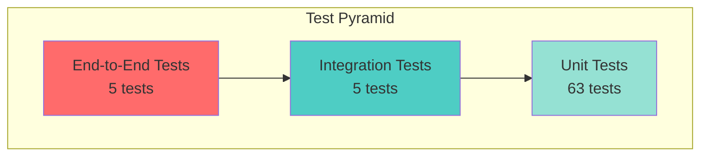
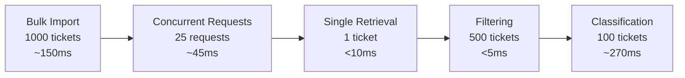
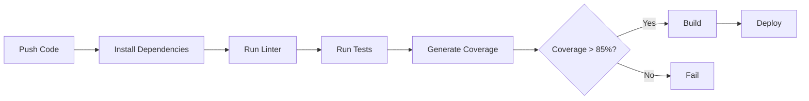

# Testing Guide

Comprehensive testing documentation for the Customer Support System.

## Test Pyramid



## Test Coverage

### Current Coverage

| Metric | Coverage | Threshold |
|--------|----------|-----------|
| Statements | 89.72% | ≥85% ✅ |
| Branches | 79.81% | ≥75% ✅ |
| Functions | 82.75% | ≥80% ✅ |
| Lines | 90.85% | ≥85% ✅ |

### Coverage by Component

| Component | Statements | Branches | Functions | Lines |
|-----------|------------|----------|-----------|-------|
| Controllers | 83.33% | 66.66% | 100% | 83.33% |
| Services | 91.97% | 84.90% | 84% | 93.75% |
| Parsers | 90.38% | 80% | 80% | 93.75% |
| Validators | 94.73% | 100% | 80% | 94.44% |
| Utils | 100% | 0% | 100% | 100% |

---

## Running Tests

### Basic Commands

```bash
# Run all tests
npm test

# Run tests with coverage
npm test -- --coverage

# Run tests in watch mode
npm run test:watch

# Run specific test file
npm test -- test_ticket_api.test.ts

# Run tests silently (less output)
npm test -- --silent
```

### Coverage Report

After running tests with coverage, view the HTML report:

```bash
open coverage/lcov-report/index.html
```

---

## Test Structure

### Test Files

```
tests/
├── test_ticket_api.test.ts       # 11 tests - API endpoints
├── test_ticket_model.test.ts     # 9 tests  - Validation
├── test_import_csv.test.ts       # 6 tests  - CSV parsing
├── test_import_json.test.ts      # 5 tests  - JSON parsing
├── test_import_xml.test.ts       # 4 tests  - XML parsing
├── test_categorization.test.ts   # 12 tests - Classification
├── test_integration.test.ts      # 5 tests  - E2E workflows
├── test_performance.test.ts      # 5 tests  - Benchmarks
├── test_logger.test.ts           # 4 tests  - Logger utility
├── test_import_service.test.ts   # 8 tests  - Import service
└── fixtures/                     # Test data files
    ├── sample_tickets.csv
    ├── sample_tickets.json
    ├── sample_tickets.xml
    ├── invalid_tickets.csv
    ├── invalid_tickets.json
    ├── invalid_tickets.xml
    ├── malformed.json
    └── malformed.xml
```

---

## Unit Tests

### API Endpoint Tests (`test_ticket_api.test.ts`)

Tests all REST API endpoints:

- ✅ Create ticket with valid data
- ✅ Reject invalid email
- ✅ Reject subject too long
- ✅ Auto-classify on creation
- ✅ List all tickets
- ✅ Filter by category
- ✅ Filter by multiple criteria
- ✅ Get specific ticket
- ✅ Return 404 for non-existent ticket
- ✅ Update ticket
- ✅ Delete ticket

**Example:**
```typescript
it('should create a new ticket with valid data', async () => {
  const response = await request(app)
    .post('/tickets')
    .send(ticketData)
    .expect(201);

  expect(response.body).toHaveProperty('id');
  expect(response.body.customer_email).toBe('test@example.com');
});
```

### Validation Tests (`test_ticket_model.test.ts`)

Tests Zod schema validation:

- ✅ Accept valid email addresses
- ✅ Reject invalid email addresses
- ✅ Reject missing email
- ✅ Accept subject within length limits
- ✅ Reject subject exceeding 200 characters
- ✅ Reject description shorter than 10 characters
- ✅ Reject description exceeding 2000 characters
- ✅ Accept valid category
- ✅ Reject invalid category/priority

### Parser Tests

#### CSV Parser (`test_import_csv.test.ts`)
- ✅ Parse valid CSV file
- ✅ Handle CSV with missing columns
- ✅ Handle empty CSV file
- ✅ Parse tags from comma-separated string
- ✅ Handle malformed CSV gracefully
- ✅ Assign correct row numbers

#### JSON Parser (`test_import_json.test.ts`)
- ✅ Parse valid JSON with wrapper object
- ✅ Parse JSON array format
- ✅ Handle invalid JSON format
- ✅ Reject non-array JSON without tickets property
- ✅ Assign correct row numbers

#### XML Parser (`test_import_xml.test.ts`)
- ✅ Parse valid XML file
- ✅ Handle single ticket in XML
- ✅ Reject XML without root tickets element
- ✅ Parse tags correctly

### Classification Tests (`test_categorization.test.ts`)

Tests auto-classification logic:

**Category Detection:**
- ✅ Classify account access issues
- ✅ Classify technical issues
- ✅ Classify billing questions
- ✅ Classify feature requests
- ✅ Classify bug reports
- ✅ Default to "other" for unclear tickets

**Priority Detection:**
- ✅ Assign urgent priority for critical issues
- ✅ Assign high priority for important issues
- ✅ Assign low priority for minor issues
- ✅ Default to medium priority

**Confidence Scoring:**
- ✅ Higher confidence with more keyword matches
- ✅ Provide reasoning for classification

---

## Integration Tests

### End-to-End Workflows (`test_integration.test.ts`)

Tests complete user journeys:

1. **Full Ticket Lifecycle**
   - Create ticket
   - Auto-classify
   - Update status to in_progress
   - Resolve ticket
   - Close ticket

2. **Bulk Import with Classification**
   - Import CSV file
   - Auto-classify all tickets
   - Verify tickets created
   - Verify classification applied

3. **Multi-Criteria Filtering**
   - Create tickets with different properties
   - Filter by category + priority
   - Verify correct results

4. **Concurrent Operations**
   - Create 20 tickets simultaneously
   - Verify all succeed
   - Check data consistency

5. **Error Handling**
   - Import invalid data
   - Verify error reporting
   - Check partial success handling

---

## Performance Tests

### Benchmarks (`test_performance.test.ts`)



### Performance Targets

| Operation | Target | Actual |
|-----------|--------|--------|
| Single ticket creation | < 50ms | ~5ms ✅ |
| Bulk import (1000) | < 500ms | ~150ms ✅ |
| Concurrent requests (25) | < 100ms | ~45ms ✅ |
| Single retrieval | < 200ms | <10ms ✅ |
| Filtering (500 tickets) | < 50ms | <5ms ✅ |
| Classification | < 5ms | ~2.7ms ✅ |

---

## Manual Testing

### Test Checklist

#### Basic CRUD Operations
- [ ] Create a ticket via POST /tickets
- [ ] Retrieve ticket via GET /tickets/:id
- [ ] List all tickets via GET /tickets
- [ ] Update ticket via PUT /tickets/:id
- [ ] Delete ticket via DELETE /tickets/:id

#### File Import
- [ ] Import valid CSV file
- [ ] Import valid JSON file
- [ ] Import valid XML file
- [ ] Import file with invalid data
- [ ] Import empty file
- [ ] Import malformed file

#### Classification
- [ ] Create ticket with auto_classify=true
- [ ] Manually classify existing ticket
- [ ] Verify keywords detected correctly
- [ ] Check confidence scores
- [ ] Review classification reasoning

#### Filtering
- [ ] Filter by single criterion
- [ ] Filter by multiple criteria
- [ ] Filter with no results
- [ ] Verify filter combinations

#### Error Handling
- [ ] Submit invalid email
- [ ] Submit subject too long
- [ ] Submit description too short
- [ ] Request non-existent ticket
- [ ] Update non-existent ticket
- [ ] Delete non-existent ticket

---

## Sample Test Data

### Valid Ticket
```json
{
  "customer_id": "CUST001",
  "customer_email": "test@example.com",
  "customer_name": "Test User",
  "subject": "Test Subject",
  "description": "This is a valid test description",
  "metadata": {
    "source": "web_form",
    "browser": "Chrome",
    "device_type": "desktop"
  }
}
```

### Invalid Ticket (Email)
```json
{
  "customer_id": "CUST001",
  "customer_email": "invalid-email",
  "customer_name": "Test User",
  "subject": "Test",
  "description": "Description",
  "metadata": { "source": "web_form" }
}
```

### Test Fixtures Location

Sample data files are available in:
- `tests/fixtures/` - Test data for automated tests
- `data/` - Sample production-like data

---

## Continuous Integration

### CI Pipeline



### GitHub Actions Example

```yaml
name: Tests
on: [push, pull_request]
jobs:
  test:
    runs-on: ubuntu-latest
    steps:
      - uses: actions/checkout@v2
      - uses: actions/setup-node@v2
        with:
          node-version: '18'
      - run: npm install
      - run: npm test -- --coverage
      - run: npm run build
```

---

## Debugging Tests

### Common Issues

1. **Tests timing out**
   - Increase Jest timeout: `jest.setTimeout(10000)`
   - Check for unresolved promises
   - Verify async/await usage

2. **Port already in use**
   - Tests use supertest (no real port)
   - If issue persists, kill process on port 3000

3. **Coverage not meeting threshold**
   - Run with `--coverage` to see report
   - Add tests for uncovered branches
   - Check edge cases

### Debug Mode

```bash
# Run tests with Node debugger
node --inspect-brk node_modules/.bin/jest --runInBand

# Run single test file in debug mode
npm test -- --runInBand test_ticket_api.test.ts
```

---

## Best Practices

### Writing Tests

1. **Arrange-Act-Assert Pattern**
   ```typescript
   it('should create ticket', async () => {
     // Arrange
     const ticketData = { ... };
     
     // Act
     const response = await request(app)
       .post('/tickets')
       .send(ticketData);
     
     // Assert
     expect(response.status).toBe(201);
   });
   ```

2. **Clean State Between Tests**
   ```typescript
   beforeEach(() => {
     ticketService.clear();
   });
   ```

3. **Descriptive Test Names**
   - Good: `should return 404 when ticket not found`
   - Bad: `test ticket retrieval`

4. **Test One Thing**
   - Each test should verify one behavior
   - Keep tests focused and simple

5. **Use Test Fixtures**
   - Store sample data in fixtures/
   - Reuse across multiple tests

---

## Performance Benchmarks

To run performance benchmarks:

```bash
npm test -- test_performance.test.ts
```

Results are logged to console with timing information.
