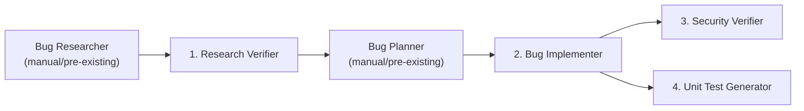

# Implementation Plan: 4-Agent Pipeline

## Overview

Build a 4-agent pipeline for automated bug fixing on the `demo-bug-fix` Express app (API-404 bug: type-coercion issue in `getUserById`). Agents use GitHub Custom Agent format (`.agent.md`), skills follow the [Agent Skills specification](https://agentskills.io/specification).

---

## Pipeline Flow



**Execution order**: Bug Researcher (pre-written) → **Research Verifier** → Bug Planner (pre-written) → **Bug Implementer** → **Security Verifier** + **Unit Test Generator** (parallel on changed code).

---

## Target Directory Structure

```
homework-4/
├── README.md
├── HOWTORUN.md
├── STUDENT.md
├── PLAN.md                              ← this file
├── agents/                              ← GitHub Custom Agent .agent.md files
│   ├── research-verifier.agent.md       ← Task 1
│   ├── bug-implementer.agent.md         ← Task 2
│   ├── security-verifier.agent.md       ← Task 3
│   └── unit-test-generator.agent.md     ← Task 4
├── skills/                              ← Agent Skills spec format
│   ├── research-quality-measurement/
│   │   └── SKILL.md                     ← Task 1.2
│   └── unit-tests-first/
│       └── SKILL.md                     ← Task 4.2
├── context/
│   └── bugs/
│       └── API-404/
│           ├── bug-context.md           ← copied from demo-bug-fix/bugs/API-404/
│           ├── research/
│           │   ├── codebase-research.md ← pre-written research input
│           │   └── verified-research.md ← OUTPUT of Agent 1
│           ├── implementation-plan.md   ← pre-written plan input
│           ├── fix-summary.md           ← OUTPUT of Agent 2
│           ├── security-report.md       ← OUTPUT of Agent 3
│           └── test-report.md           ← OUTPUT of Agent 4
├── demo-bug-fix/                        ← existing app (will be modified by Agent 2)
│   ├── package.json
│   ├── server.js
│   ├── src/
│   │   ├── controllers/userController.js
│   │   └── routes/users.js
│   └── tests/                           ← created by Agent 4
│       └── userController.test.js
├── tests/                               ← alternative: tests at homework-4 level
└── docs/
    └── screenshots/                     ← pipeline screenshots
```

---

## Phase 0: Prerequisites (Manual Preparation)

### 0.1 Create `codebase-research.md`
**Purpose**: Simulates the Bug Researcher agent output — the input for Agent 1.

**Content**: Research document covering:
- Bug description (API-404: GET /api/users/:id returns 404 for all valid IDs)
- Codebase analysis with file:line references
  - `server.js:7` — imports routes
  - `src/routes/users.js:13` — route definition `GET /api/users/:id`
  - `src/controllers/userController.js:22` — `req.params.id` returns string
  - `src/controllers/userController.js:25` — `users.find(u => u.id === userId)` strict equality fails
- Root cause: `req.params.id` is always a string, but `users` array has numeric IDs. Strict equality `===` between `"123"` and `123` is always `false`.
- Code snippets from source files
- Related endpoints analysis

### 0.2 Create `implementation-plan.md`
**Purpose**: Simulates the Bug Planner agent output — the input for Agent 2.

**Content**: Step-by-step plan:
1. **File**: `demo-bug-fix/src/controllers/userController.js`
2. **Location**: Line 25, inside `getUserById`
3. **Before**: `const user = users.find(u => u.id === userId);`
4. **After**: `const user = users.find(u => u.id === Number(userId));`
5. **Rationale**: Convert string param to number before comparison
6. **Test command**: `curl http://localhost:3000/api/users/123` should return user object
7. **Validation**: Response status 200, body contains `{"id":123,"name":"Alice Smith",...}`

---

## Phase 1: Skills Creation

### 1.1 Skill: `research-quality-measurement` (Task 1.2)

**Format**: Agent Skills specification ([agentskills.io/specification](https://agentskills.io/specification))

**File**: `skills/research-quality-measurement/SKILL.md`

```yaml
---
name: research-quality-measurement
description: >
  Defines quality levels for bug research assessment. Use when verifying
  research documents, measuring research completeness, or rating the
  quality of codebase analysis reports.
---
```

**Body content — Quality Levels**:

| Level | Label | Criteria |
|-------|-------|----------|
| 5 | Excellent | All file:line refs verified, all snippets match source, root cause correct, complete context |
| 4 | Good | 90%+ refs verified, minor snippet discrepancies, root cause correct |
| 3 | Adequate | 70-89% refs verified, some inaccuracies, root cause partially correct |
| 2 | Poor | 50-69% refs verified, significant inaccuracies, root cause unclear |
| 1 | Inadequate | <50% refs verified, major errors, root cause wrong or missing |

**Scoring dimensions**:
- **Reference Accuracy** (0-25): Do file:line references point to correct locations?
- **Snippet Fidelity** (0-25): Do code snippets match actual source code?
- **Root Cause Analysis** (0-25): Is the identified root cause correct and complete?
- **Completeness** (0-25): Are all relevant files/functions/paths covered?

**Total**: Sum of dimensions → maps to quality level.

### 1.2 Skill: `unit-tests-first` (Task 4.2)

**Format**: Agent Skills specification

**File**: `skills/unit-tests-first/SKILL.md`

```yaml
---
name: unit-tests-first
description: >
  Defines the FIRST principles for unit testing. Use when generating,
  reviewing, or validating unit tests to ensure they meet quality standards.
---
```

**Body content — FIRST Principles**:

| Principle | Meaning | Checklist |
|-----------|---------|-----------|
| **F**ast | Tests execute quickly (<100ms each) | No network calls, no disk I/O, mock external deps |
| **I**ndependent | Tests don't depend on each other | No shared mutable state, can run in any order |
| **R**epeatable | Same result every run, any environment | No random data, no time-dependent logic, deterministic |
| **S**elf-validating | Pass/fail without manual inspection | Uses assertions, not console.log inspection |
| **T**imely | Written close to the code they test | Tests for changed code only, not unrelated code |

**Compliance template** for each test:
```
- [ ] Fast: Executes in < 100ms
- [ ] Independent: No shared state with other tests
- [ ] Repeatable: Deterministic result
- [ ] Self-validating: Uses proper assertions
- [ ] Timely: Tests the specific changed code
```

---

## Phase 2: Agent Creation

### 2.1 Agent 1: Research Verifier (Task 1)

**File**: `agents/research-verifier.agent.md`

**Format**: GitHub Custom Agent (`.agent.md` with YAML frontmatter)

```yaml
---
name: research-verifier
description: >
  Fact-checker for bug research output. Reads codebase-research.md,
  verifies all file:line references and code snippets against actual
  source code, and produces verified-research.md with quality assessment.
tools: ["read", "search", "edit"]
---
```

**Prompt instructions**:
1. Read the skill `skills/research-quality-measurement/SKILL.md` to load quality criteria
2. Read `context/bugs/{BUG_ID}/research/codebase-research.md`
3. For every file:line reference in the research:
   - Open the referenced file at the specified line
   - Verify the code snippet matches actual source
   - Record: PASS/FAIL + actual content if different
4. For every claim about behavior:
   - Cross-reference with actual code logic
   - Verify root cause analysis
5. Write `context/bugs/{BUG_ID}/research/verified-research.md` with sections:
   - **Verification Summary**: Overall pass/fail + Research Quality Level (per skill)
   - **Verified Claims**: Table of each claim with status
   - **Discrepancies Found**: Details of any mismatches
   - **Research Quality Assessment**: Level (1-5) + score breakdown + reasoning
   - **References**: Files checked

**Handoff**: → Bug Planner (manual step, then to bug-implementer)

### 2.2 Agent 2: Bug Implementer (Task 2)

**File**: `agents/bug-implementer.agent.md`

```yaml
---
name: bug-implementer
description: >
  Executes a bug fix implementation plan. Reads implementation-plan.md,
  applies code changes, runs tests, and produces fix-summary.md.
tools: ["read", "edit", "search", "terminal"]
handoffs:
  - label: Run Security Review
    agent: security-verifier
    prompt: >
      Review the changes documented in fix-summary.md for security issues.
    send: false
  - label: Generate Unit Tests
    agent: unit-test-generator
    prompt: >
      Generate unit tests for the changes documented in fix-summary.md.
    send: false
---
```

**Prompt instructions**:
1. Read `context/bugs/{BUG_ID}/implementation-plan.md`
2. For each change in the plan:
   a. Open the target file
   b. Verify the "before" code matches current source
   c. Apply the change (replace "before" with "after" code)
   d. Run the test command specified in the plan
   e. Record result: PASS/FAIL + output
3. If any test fails: document failure, revert change, stop
4. Write `context/bugs/{BUG_ID}/fix-summary.md` with:
   - **Changes Made**: File, location, before/after snippets, test result
   - **Overall Status**: SUCCESS/FAILURE
   - **Manual Verification**: Steps to manually verify the fix
   - **References**: Files modified, plan reference

### 2.3 Agent 3: Security Verifier (Task 3)

**File**: `agents/security-verifier.agent.md`

```yaml
---
name: security-verifier
description: >
  Security review agent for modified code. Reads fix-summary.md and
  changed files, scans for vulnerabilities, and produces security-report.md.
  Does NOT modify any code.
tools: ["read", "search"]
---
```

**Prompt instructions** (READ-ONLY — no code edits):
1. Read `context/bugs/{BUG_ID}/fix-summary.md`
2. For each changed file listed:
   - Read the full file
   - Scan for security issues:
     - **Injection**: SQL injection, command injection, NoSQL injection
     - **Hardcoded Secrets**: API keys, passwords, tokens in source
     - **Insecure Comparisons**: Timing attacks, loose equality misuse
     - **Missing Validation**: Input validation, type checking, bounds
     - **Unsafe Dependencies**: Known CVEs, outdated packages
     - **XSS/CSRF**: (if web-facing) unescaped output, missing CSRF tokens
3. Rate each finding: CRITICAL / HIGH / MEDIUM / LOW / INFO
4. Write `context/bugs/{BUG_ID}/security-report.md` with:
   - **Summary**: Total findings by severity
   - **Findings**: Each with severity, file:line, description, remediation
   - **Overall Risk Assessment**
   - **Recommendations**

### 2.4 Agent 4: Unit Test Generator (Task 4)

**File**: `agents/unit-test-generator.agent.md`

```yaml
---
name: unit-test-generator
description: >
  Generates and runs unit tests for changed code. Reads fix-summary.md,
  generates tests following FIRST principles, and produces test-report.md.
tools: ["read", "edit", "search", "terminal"]
---
```

**Prompt instructions**:
1. Read the skill `skills/unit-tests-first/SKILL.md` to load FIRST principles
2. Read `context/bugs/{BUG_ID}/fix-summary.md`
3. For each changed file:
   - Read the file to understand the fix
   - Generate unit tests covering:
     - The **fixed behavior** (regression test)
     - **Edge cases** around the fix (e.g., string "0", negative IDs, non-numeric strings)
     - **Existing behavior** that should not break
4. Use the project's test framework (Jest if available, otherwise install it)
5. Validate each test against FIRST checklist:
   - Fast: No external deps
   - Independent: No shared state
   - Repeatable: Deterministic
   - Self-validating: Proper assertions
   - Timely: Tests only changed code
6. Run tests: `npm test` or `npx jest`
7. Write `context/bugs/{BUG_ID}/test-report.md` with:
   - **Test Summary**: Total tests, pass/fail counts
   - **FIRST Compliance**: Per-test checklist
   - **Test Details**: Each test name, description, result
   - **Coverage Notes**
   - **Test Files Created**: Paths
8. Also save test files to `demo-bug-fix/tests/`

---

## Phase 3: Pipeline Execution

### Step 1: Run Research Verifier
```
Switch to @research-verifier agent in VS Code
Prompt: "Verify the research in context/bugs/API-404/research/codebase-research.md against the actual source code in demo-bug-fix/"
```
**Expected output**: `context/bugs/API-404/research/verified-research.md`

### Step 2: Run Bug Implementer
```
Switch to @bug-implementer agent
Prompt: "Execute the implementation plan in context/bugs/API-404/implementation-plan.md to fix bug API-404"
```
**Expected output**: `context/bugs/API-404/fix-summary.md` + modified `userController.js`

### Step 3a: Run Security Verifier
```
Switch to @security-verifier agent
Prompt: "Review the changes from context/bugs/API-404/fix-summary.md for security vulnerabilities"
```
**Expected output**: `context/bugs/API-404/security-report.md`

### Step 3b: Run Unit Test Generator
```
Switch to @unit-test-generator agent
Prompt: "Generate unit tests for the changes in context/bugs/API-404/fix-summary.md following FIRST principles"
```
**Expected output**: `context/bugs/API-404/test-report.md` + test files

### Step 4: Capture Screenshots
- Pipeline execution in VS Code (agent switching + handoffs)
- Fix applied (before/after curl output)
- Security scan report
- Unit test run results

---

## Phase 4: Documentation

### 4.1 README.md
- Project overview: 4-agent pipeline for automated bug fixing
- Architecture diagram (mermaid)
- Agent descriptions table
- Skills descriptions
- Quick start instructions
- Link to HOWTORUN.md

### 4.2 HOWTORUN.md
- Prerequisites (Node.js, VS Code with Copilot)
- Install dependencies: `cd demo-bug-fix && npm install`
- How to load agents (configure VS Code `chat.agentFilesLocations` or copy to `.github/agents/`)
- Step-by-step pipeline execution
- How to verify the fix: `npm start` + curl commands

### 4.3 STUDENT.md
- Student name and course info

---

## The Bug: API-404 Analysis

| Aspect | Detail |
|--------|--------|
| **Bug** | `GET /api/users/:id` returns 404 for all valid IDs |
| **Root Cause** | Type coercion: `req.params.id` is string (`"123"`), but `users[].id` is number (`123`). Strict `===` always returns `false`. |
| **File** | `demo-bug-fix/src/controllers/userController.js` line 25 |
| **Before** | `const user = users.find(u => u.id === userId);` |
| **After** | `const user = users.find(u => u.id === Number(userId));` |
| **Test** | `curl http://localhost:3000/api/users/123` → should return `{"id":123,...}` |

---

## Implementation Order

| # | Task | Type | Depends On | Output |
|---|------|------|------------|--------|
| 1 | Create `research-quality-measurement` skill | Skill | — | `skills/research-quality-measurement/SKILL.md` |
| 2 | Create `unit-tests-first` skill | Skill | — | `skills/unit-tests-first/SKILL.md` |
| 3 | Write `codebase-research.md` | Context | — | `context/bugs/API-404/research/codebase-research.md` |
| 4 | Write `implementation-plan.md` | Context | — | `context/bugs/API-404/implementation-plan.md` |
| 5 | Copy `bug-context.md` | Context | — | `context/bugs/API-404/bug-context.md` |
| 6 | Create Research Verifier agent | Agent | 1 | `agents/research-verifier.agent.md` |
| 7 | Create Bug Implementer agent | Agent | — | `agents/bug-implementer.agent.md` |
| 8 | Create Security Verifier agent | Agent | — | `agents/security-verifier.agent.md` |
| 9 | Create Unit Test Generator agent | Agent | 2 | `agents/unit-test-generator.agent.md` |
| 10 | Run Agent 1 (Research Verifier) | Execute | 3, 6 | `verified-research.md` |
| 11 | Run Agent 2 (Bug Implementer) | Execute | 4, 7 | `fix-summary.md` + code fix |
| 12 | Run Agent 3 (Security Verifier) | Execute | 8, 11 | `security-report.md` |
| 13 | Run Agent 4 (Unit Test Generator) | Execute | 9, 11 | `test-report.md` + test files |
| 14 | Capture screenshots | Docs | 10-13 | `docs/screenshots/` |
| 15 | Write README, HOWTORUN, STUDENT | Docs | All | Root docs |

---

## Key Design Decisions

1. **Agent format**: GitHub Custom Agent `.agent.md` (YAML frontmatter + Markdown prompt) — works in VS Code via `.github/agents/` or `chat.agentFilesLocations`
2. **Skill format**: Agent Skills spec (`SKILL.md` in named directory with YAML frontmatter) — agents reference skills via relative path
3. **Handoffs**: Bug Implementer hands off to Security Verifier and Unit Test Generator via the `handoffs` property
4. **Tools scoping**:
   - Research Verifier: `read`, `search`, `edit` (needs edit for writing verified-research.md)
   - Bug Implementer: `read`, `edit`, `search`, `terminal` (needs terminal to run tests)
   - Security Verifier: `read`, `search` (read-only by design)
   - Unit Test Generator: `read`, `edit`, `search`, `terminal` (needs edit + terminal for tests)
5. **Context isolation**: Each bug gets its own directory under `context/bugs/{BUG_ID}/`
6. **Test framework**: Jest (add to demo-bug-fix `devDependencies`)
