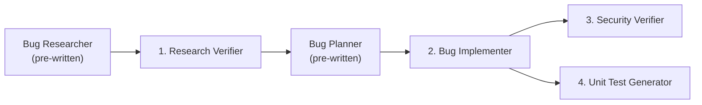

# Homework 4 — 4-Agent Bug-Fix Pipeline

## Overview

This project implements a **4-agent pipeline** for automated bug research, implementation, security review, and test generation using GitHub Copilot Custom Agents.

**Target application**: A small Express.js API (`demo-bug-fix/`) with a real bug (API-404: `GET /api/users/:id` always returns 404).



---

## The Bug (API-404)

| | |
|-|--|
| **Endpoint** | `GET /api/users/:id` |
| **Symptom** | Returns 404 for all valid user IDs |
| **Root cause** | `req.params.id` is a string; `users[].id` is a number; `===` never coerces types |
| **Fix** | `users.find(u => u.id === Number(userId))` |

---

## Project Structure

```
homework-4/
├── README.md
├── HOWTORUN.md
├── STUDENT.md
├── PLAN.md
├── agents/                              # GitHub Copilot Custom Agents
│   ├── pipeline-orchestrator.agent.md   # Entry point — coordinates all 4 agents
│   ├── research-verifier.agent.md       # Task 1 — verifies research quality
│   ├── bug-implementer.agent.md         # Task 2 — applies the fix
│   ├── security-verifier.agent.md       # Task 3 — security scan (read-only)
│   └── unit-test-generator.agent.md     # Task 4 — generates FIRST-compliant tests
├── skills/                              # Agent Skills (agentskills.io format)
│   ├── research-quality-measurement/
│   │   └── SKILL.md                     # Task 1.2 — 5-level quality scale
│   └── unit-tests-first/
│       └── SKILL.md                     # Task 4.2 — FIRST principles
├── context/
│   └── bugs/
│       └── API-404/
│           ├── bug-context.md
│           ├── research/
│           │   ├── codebase-research.md # Input → Research Verifier
│           │   └── verified-research.md # Output of Agent 1 ← (generated by agent)
│           ├── implementation-plan.md   # Input → Bug Implementer
│           ├── fix-summary.md           # Output of Agent 2 ← (generated by agent)
│           ├── security-report.md       # Output of Agent 3 ← (generated by agent)
│           └── test-report.md           # Output of Agent 4 ← (generated by agent)
├── demo-bug-fix/                        # Target application
│   ├── package.json
│   ├── server.js
│   ├── src/
│   │   ├── controllers/userController.js
│   │   └── routes/users.js
│   └── tests/
│       └── userController.test.js       # Generated by Agent 4
└── docs/
    └── screenshots/                     # Pipeline run screenshots
```

---

## Agents

### Orchestrator (entry point)

| Agent | File | Role |
|-------|------|------|
| **Pipeline Orchestrator** | `agents/pipeline-orchestrator.agent.md` | Coordinates all four subagents in order, enforces gate checks, and writes `pipeline-summary.md` |

### Pipeline stages

| Agent | File | Role | Tools |
|-------|------|------|-------|
| **Research Verifier** | `agents/research-verifier.agent.md` | Verifies file:line references and snippets; scores research quality using the `research-quality-measurement` skill | read, search, edit |
| **Bug Implementer** | `agents/bug-implementer.agent.md` | Applies code changes from `implementation-plan.md`; runs curl tests; writes `fix-summary.md` | read, edit, search, terminal |
| **Security Verifier** | `agents/security-verifier.agent.md` | Read-only scan of changed code for injection, secrets, missing validation, etc. | read, search |
| **Unit Test Generator** | `agents/unit-test-generator.agent.md` | Generates FIRST-compliant Jest tests for changed code only; runs tests | read, edit, search, terminal |

---

## Skills

| Skill | Directory | Description |
|-------|-----------|-------------|
| `research-quality-measurement` | `skills/research-quality-measurement/` | Defines a 5-level quality scale (Inadequate → Excellent) with 4 scoring dimensions (reference accuracy, snippet fidelity, root cause, completeness). Scores out of 100. |
| `unit-tests-first` | `skills/unit-tests-first/` | Defines FIRST: Fast, Independent, Repeatable, Self-validating, Timely. Includes a per-test compliance checklist. |

---

## How to Run

See [HOWTORUN.md](HOWTORUN.md) for step-by-step instructions.

---

## Agent Outputs

After running the pipeline, the following files are generated:

| File | Generated by |
|------|-------------|
| `context/bugs/API-404/research/verified-research.md` | Research Verifier |
| `context/bugs/API-404/fix-summary.md` | Bug Implementer |
| `context/bugs/API-404/security-report.md` | Security Verifier |
| `context/bugs/API-404/test-report.md` | Unit Test Generator |
| `demo-bug-fix/tests/userController.test.js` | Unit Test Generator |
| `context/bugs/API-404/pipeline-summary.md` | Pipeline Orchestrator |

---

## Author

See [STUDENT.md](STUDENT.md).
